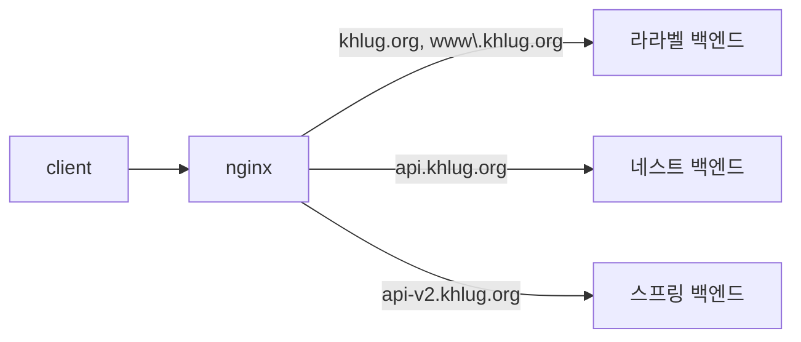

# sight-infra

경희대학교 중앙 IT 동아리 쿠러그의 사이트(sight) 내 인프라를 관리하는 레포지토리입니다.

## 인프라 구조



> [!NOTE]
>
> 위 인프라 구조는 [`mermaid`](https://mermaid.js.org/)로 관리하여 쉽게 수정 및 버전 관리할 수 있도록 유지해주세요.

## 폴더 구조

```
sight-infra/
├── nestjs-backend/
├── reverse-proxy/
└── README.md
```

- `nestjs-backend`: NestJS 백엔드입니다. 주로 디스코드 관련 요청을 처리합니다. 자세한 내용은 [README](./nestjs-backend/README.md)를 참고해주세요.
- `reverse-proxy`: 인프라의 가장 앞단에서 요청을 최초로 받는 곳입니다. SSL Termination 및 `Host`에 따른 트래픽 라우팅을 수행합니다. 자세한 내용은 [README](./reverse-proxy/README.md)를 참고해주세요.
